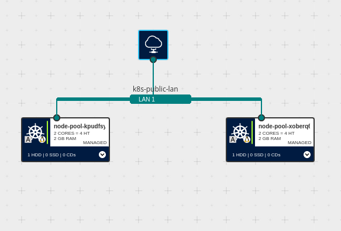

# Kubernetes Set-Up
**Please Note: this software is provided without any warranty**

## Infrastructure concept for K8S setup with 2 nodes
This Infrastructure as a Code (IaC) will create the following resources:
* 1 K8S control plane instance
* 1 Node Pool of 2 nodes
