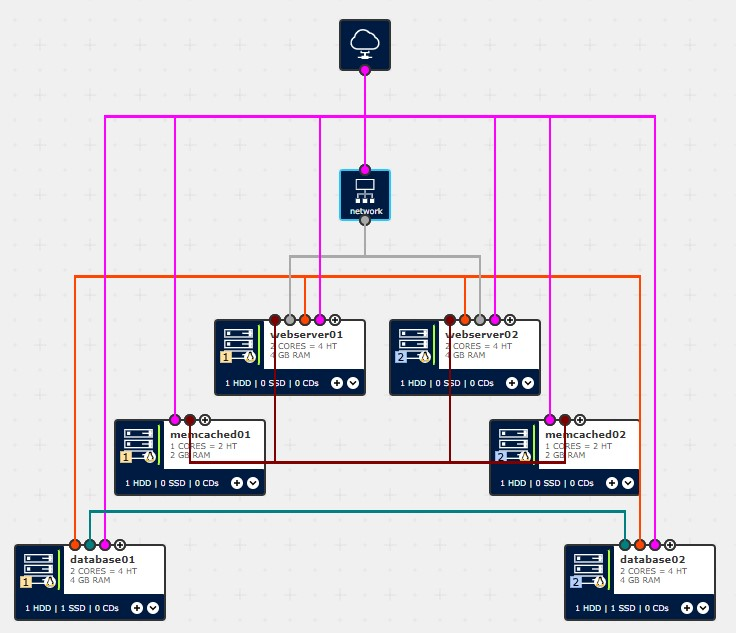

# Magento Redundant Set-Up and Memcached
**Please Note: this software is provided without any warranty**

## Infrastructure concept for hosting a Magento Website
This Infrastructure as a Code (IaC) will create the following resources:
* 1 Virtual Data Center
* 1 Reserved IP address
* 1 Network Load Balancer configured to serve 443 against the 2 Webservers
* 2 Webservers
* 2 DB servers
* 2 Memcached servers
* 1 Public Network from Internet to the Load Balancer
* 1 Private Network between Load Balancer and Webservers
* 1 Private Network between Webservers and DBs
* 1 Private Network between Webservers and Memcahced
* 1 Private Network between DBs

## Basic software to be installed
- Apache/Nginx + PHP for the Webservers
- Mysql in replica for the 2 DB server (just master/replica)
- Memcached

## Additional Software required to have Magento working in a clustered environment
Object-Storage (s3 bucket) mounted on all webservers to avoid Magento using too much disk space for the images.

One of the following software to achieve the previous point:
* S3FS-FUSE
* ObjectiveFS
* RioFS
Memcache service installed as a service in each server in mirroring configuration and used to save php sessions so customers will not lose the basket while shopping.

CDN is not necessary but it can be useful during peaks to serve more requests

SSL Certificate to be set up on all the webservers and CDN if used
